# 요식업 상권 정보 제공 플랫폼 Let’s Be CEO

### 전공 종합 설계 경진대회 - 4위 수상

“창업에 겁내지 말자!**"**

### 📣구현 기능 및 기술

#### <지역구 내 상권분석에 대한 간략한 정보 제공> 

#### <지역구 내 상권의 선택 업종에 관련한 상세한 분석 정보 제공> 
▶ 상세 매출 분석  
▶ 상세 지역 분석  
▶ 상세 인구 분석  

#### <손익분기점 관련 정보 제공> 
▶ 고정 비용, 변동 비용에 대한 값을 입력받고 대략적인 손익분기점 예측/제공  
▶ 목표 순이익에 대한 값을 입력 받고 그에 따른 대략적 목표 매출 예측/제공  
▶ 메뉴 평균 단가에 대한 값을 입력 받고 목표 매출에 따른 일 평균 필요 판매량 예측/제공  

#### <예비 창업자와 현 창업자 들을 위한 게시판 제공> 
▶ 예비 창업자들과 기존 창업자들이 정보를 공유하는데 목적을 가진 게시판 기능 제공.  

#### <문의 사항> 
▶ 사용자는 문의 사항을 통해 관리자에게 서비스에 대한 QnA 기능 제공  

### 📣개발환경

- React  v17.0.2
- node.js v16.14.0
- mysql v2.18.1

### 📣결과물

#### 메인페이지

#### **지역 선택**
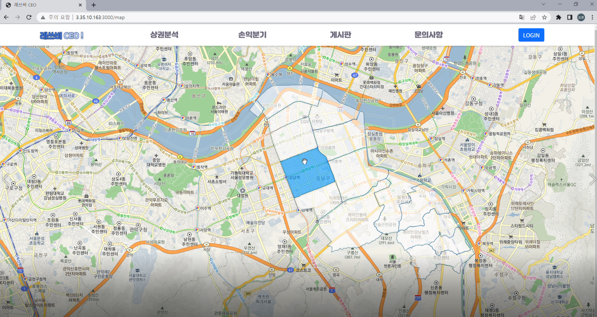

#### **상권 간단 분석**

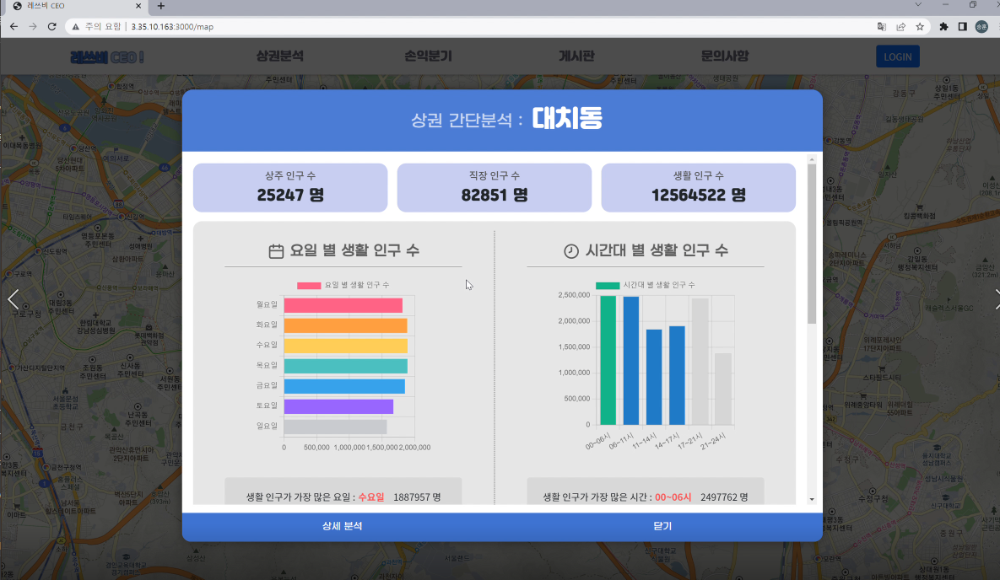
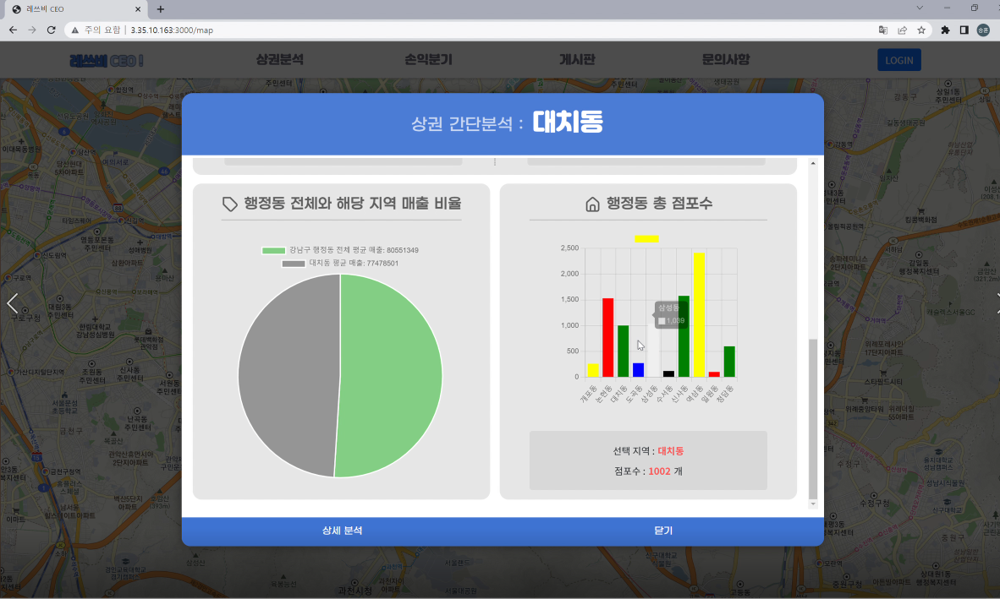

#### **가이드**

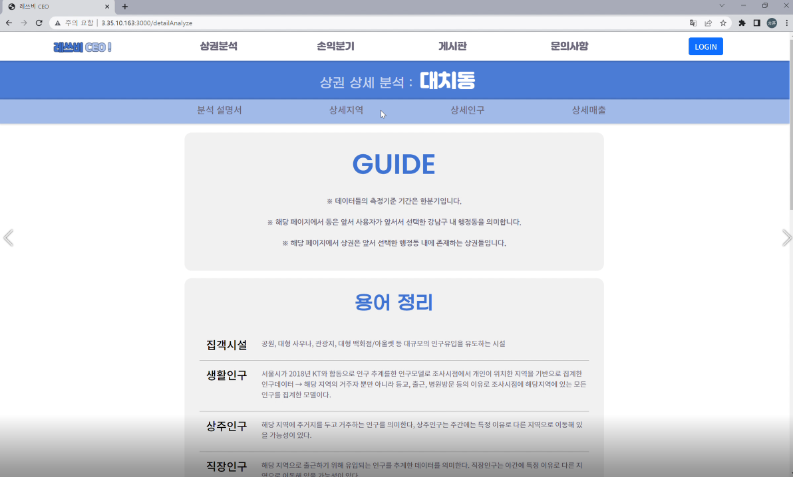

#### **상권 상세 분석 - 지역(상권 선택 전)**

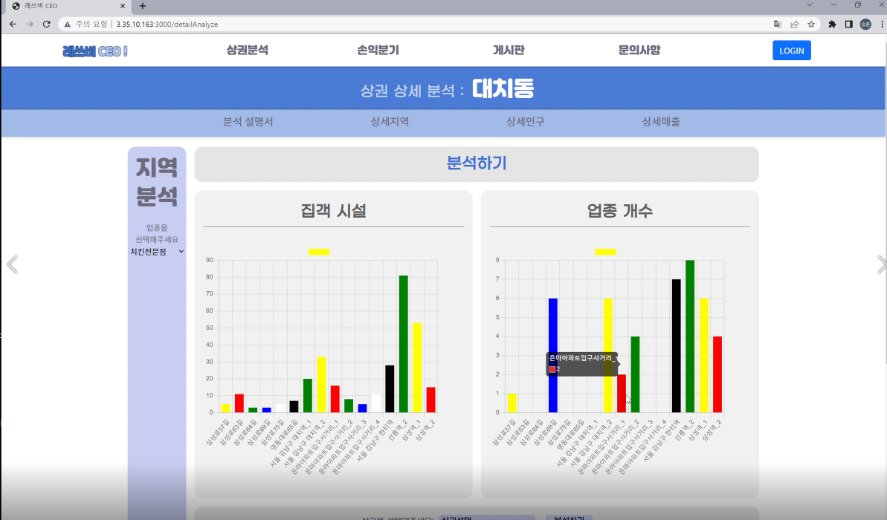

#### ****

#### 상권 상세 분석 - 지역(상권 선택 후)

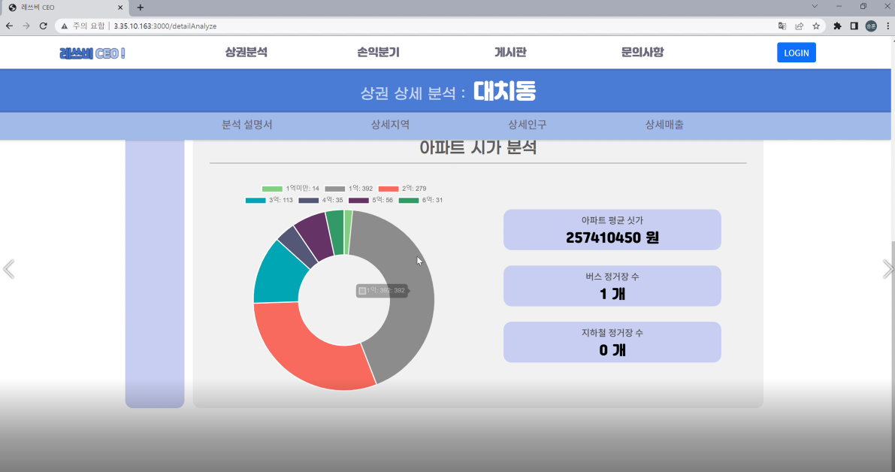

#### **상권 상세 분석 - 인구(상권 선택 전)**

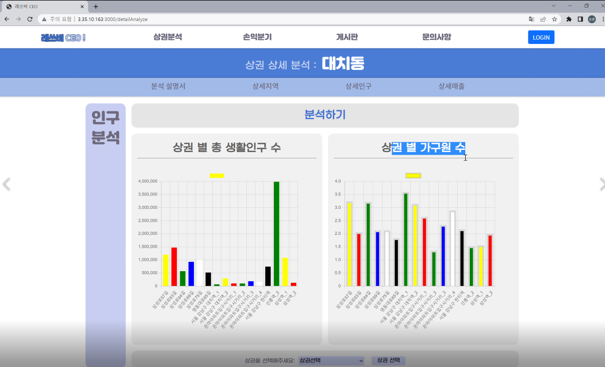

#### **상권 상세 분석 - 인구(상권 선택 후)**

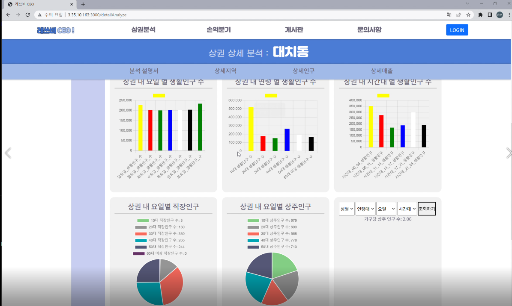

#### **상권 상세 분석 - 매출(상권 선택 전)**

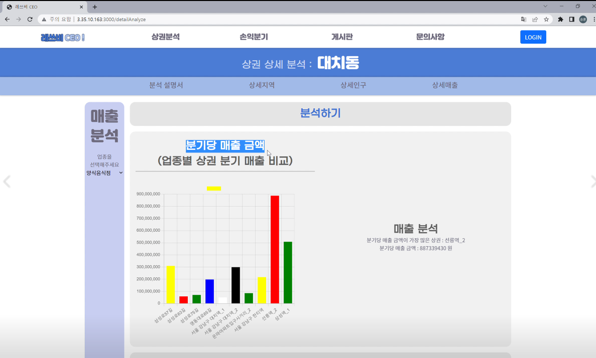

#### **상권 상세 분석 - 매출(상권 선택 후)**

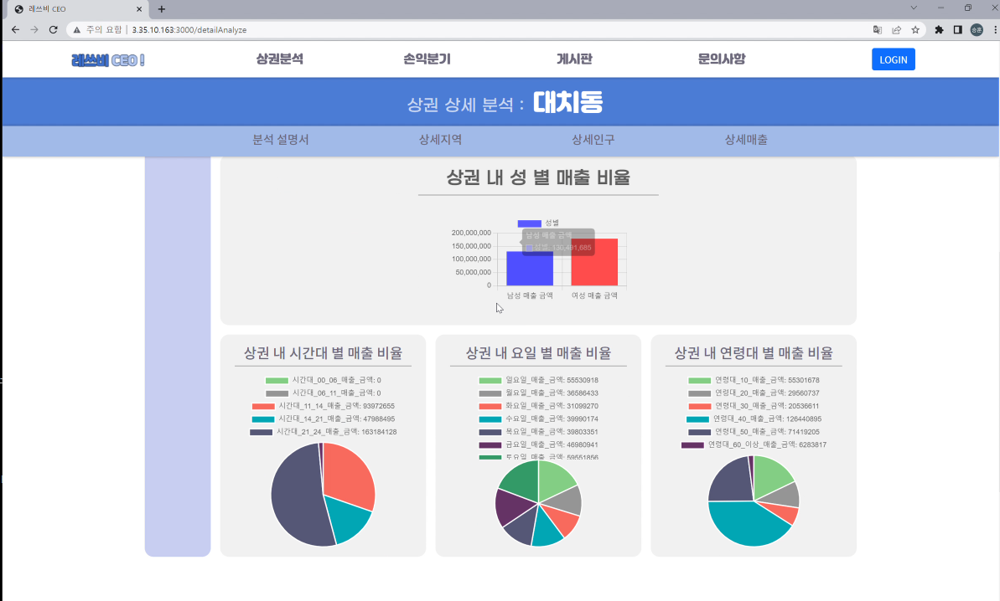

#### **손익분기점 계산**

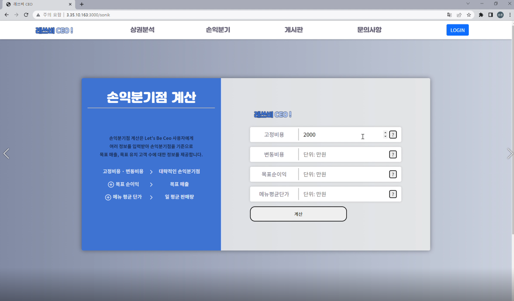
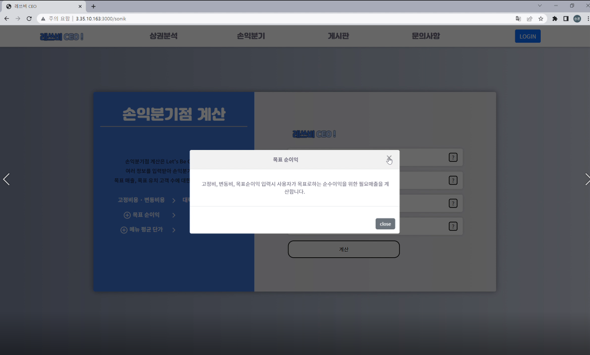
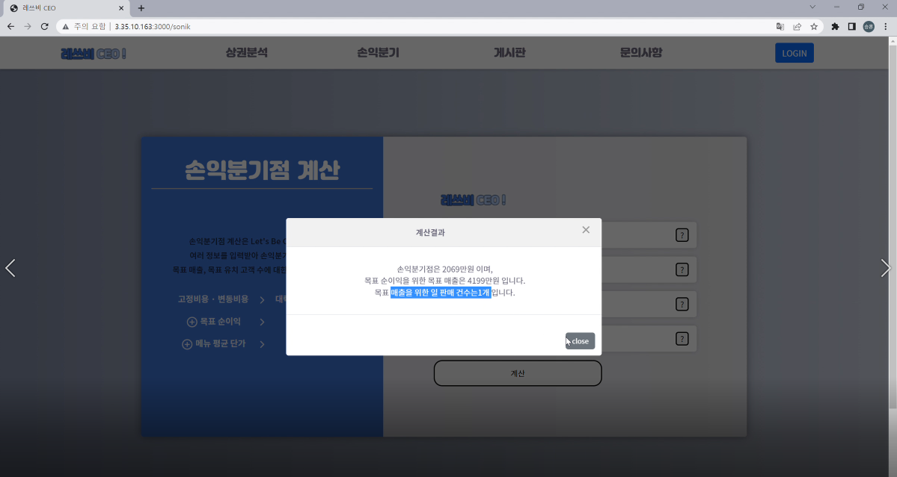

#### 소통 공간

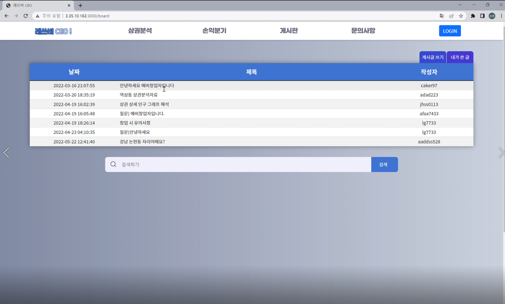

#### 📣 시연영상

[https://www.youtube.com/watch?v=i3RMGNMNdJk&feature=youtu.be](https://www.youtube.com/watch?v=tUI9SSWdT2Q)

#### 📣 문서
https://drive.google.com/file/d/1gmIGSWnwAyv647p0shIk-7t26vjBThAO/view

